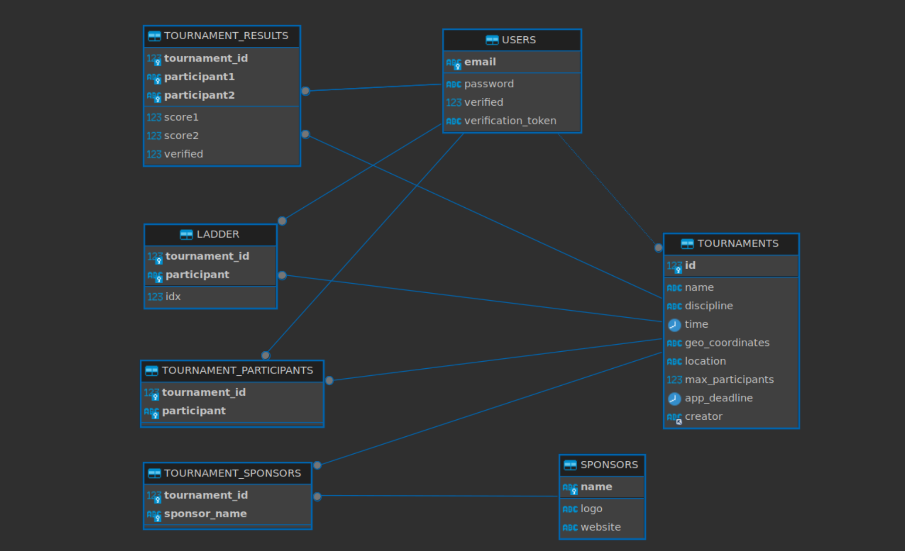

# Tournament organizer web application

## Description
A web application that allows users to create tournaments, join tournaments, track tournament progress, and view tournament results.


## Tech Stack
JavaScript

**Backend:**

- Node.js 
- MySQL
- Express (server)
- Sequelize (ORM)
- Nodemailer (mail)

**Frontend:**  
- React
- Bootstrap
- HTML
- CSS
- React-Leaflet (openstreet map)


## Installation
1. Clone the repository
    ```
    git clone git@github.com:istepka/torunamently.git
    ```
2. Install dependencies for the backend and frontend
    ```
    cd backend
    npm install

    cd ../frontend
    npm install
    ```
3. Make sure you have MySQL installed and running. If not, follow the instructions below.

4. Set up `email_config.json` file in `backend/` folder. 
    Important thing is that the email you use does support smtp from third party applications (i.e., is not that secure, I used wp.pl)
    ```
    {
        "user": "EMAIL",
        "password": "PASSWORD"
    }
    ```


## Install and run MySQL
1. Install MySQL
    ```
    sudo apt install mysql-server
    ```
2. Check MySQL status. It should be active and running.
    ```
    sudo service mysql status
    ```
3. Check the network status
    ```
    sudo ss -tap | grep mysql
    ```
4. If MySQL is not running, correctly, restart it.
    ```
    sudo service mysql restart
    ```
5. If you make changes to the MySQL configuration file, restart MySQL with the following command:
    ```
    sudo systemctl restart mysql.service
    ``` 

6. Set up config file: `db_config.json` in `backend/` folder. 
    ```
    {
        "host": "localhost",
        "user": "USERNAME",
        "password": "ADMIN",
        "port": 3306,
        "database": "tournamently"
    }
    ```

7. Run the following commands in mysql shell to create database structure:
    ```
    CREATE DATABASE tournamently;
    ```

    Run scripts from `scripts/` folder in the following order:
    ```
    mysql -u USERNAME -p tournamently < set_up.sql
    mysql -u USERNAME -p tournamently < populate.sql
    ```

    To reset the database, run the following command:
    ```
    mysql -u USERNAME -p tournamently < anihilate.sql
    ```

    And then run the scripts again.

## Application schema
This is just a draft that was created to get a better understanding of the application structure. The final app is a bit more complex, but I don't want to create a new schema becuase it would take too much time. The schema below is a good representation of the application structure.
 

## Database relations
(yes it is not normalized :))


## A couple of screenshots from the app

Main page


Login page


Verification email 

Account page


Create tournament page


Edit tournament page


Tournament page


Ladder page - auto generated


## License
MIT License
